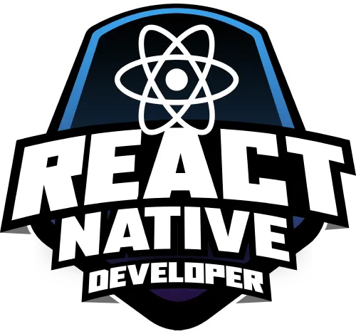

<table>
  <tr>
    <td>
      <h1>📱 Curso de React Native - DIO</h1>
    </td>
    <td align="right">
      
    </td>
  </tr>
</table>


Repositório com os conteúdos, exercícios e projetos desenvolvidos durante o curso de **React Native** oferecido pela [DIO.me (Digital Innovation One)](https://dio.me).

## 🧑‍🏫 Sobre o Curso

O curso aborda os principais conceitos e ferramentas para o desenvolvimento de aplicativos móveis utilizando **React Native**, com foco prático em criação de interfaces, navegação, integração com APIs e gerenciamento de estado.

## 📚 Conteúdo Abordado

- Introdução ao React Native
- Configuração do ambiente de desenvolvimento
- Estrutura de um projeto React Native
- Componentes e Props
- Estados e Eventos
- Estilização com StyleSheet
- Navegação com React Navigation
- Consumo de APIs com Fetch e Axios
- Armazenamento local com AsyncStorage
- Gerenciamento de estado com Context API

## 🛠 Tecnologias Utilizadas

- React Native
- JavaScript / TypeScript (opcional)
- Expo CLI / React Native CLI
- React Navigation
- Axios
- AsyncStorage

## 🚀 Projetos Desenvolvidos

1. **App de Green Lantern**
   - Objetivo: Primeiros passos com componentes e estilização e uso de estados


### ▶️ Como Executar

1. Clone o repositório:
   ```bash
   git clone https://github.com/codeguima/nome-do-repos.git

Claro! Aqui está um modelo de `README.md` para um repositório de um curso de **React Native** realizado na **DIO (Digital Innovation One)**. Você pode personalizá-lo conforme os detalhes do curso e do seu progresso:

---

````markdown
# 📱 Curso de React Native - DIO

Repositório com os conteúdos, exercícios e projetos desenvolvidos durante o curso de **React Native** oferecido pela [DIO.me (Digital Innovation One)](https://dio.me).

## 🧑‍🏫 Sobre o Curso

O curso aborda os principais conceitos e ferramentas para o desenvolvimento de aplicativos móveis utilizando **React Native**, com foco prático em criação de interfaces, navegação, integração com APIs e gerenciamento de estado.

## 📚 Conteúdo Abordado

- Introdução ao React Native
- Configuração do ambiente de desenvolvimento
- Estrutura de um projeto React Native
- Componentes e Props
- Estados e Eventos
- Estilização com StyleSheet
- Navegação com React Navigation
- Consumo de APIs com Fetch e Axios
- Armazenamento local com AsyncStorage
- Gerenciamento de estado com Context API

## 🛠 Tecnologias Utilizadas

- React Native
- JavaScript / TypeScript (opcional)
- Expo CLI / React Native CLI
- React Navigation
- Axios
- AsyncStorage

## 🚀 Projetos Desenvolvidos

1. **App de Boas-Vindas**
   - Objetivo: Primeiros passos com componentes e estilização

2. **ToDo List**
   - Objetivo: Trabalhar com estados, eventos e listas

3. **App de Filmes**
   - Objetivo: Integração com API externa e navegação entre telas

4. **App de Login**
   - Objetivo: Interface com validação e armazenamento de token

## ▶️ Como Executar

1. Clone o repositório:
   ```bash
   git clone https://github.com/seu-usuario/nome-do-repositorio.git
````

2. Acesse a pasta do projeto:

   ```bash
   cd nome-do-repositorio
   ```

3. Instale as dependências:

   ```bash
   npm install
   # ou
   yarn install
   ```

4. Inicie o projeto:

   ```bash
   npm start
   # ou
   yarn start
   ```

> 💡 Requer o ambiente do [Expo](https://expo.dev/) instalado, ou o uso do emulador Android/iOS.

## 👨‍💻 Autor

Feito por **\[Jhonny Guimarães]**
🔗 [codeguima.com.br](https://www.codeguima.com.br)
💼 [LinkedIn](https://linkedin.com/in/jhonny-guimaraes)

---

## 📌 Licença

Este repositório está licenciado sob a [MIT License](LICENSE).


