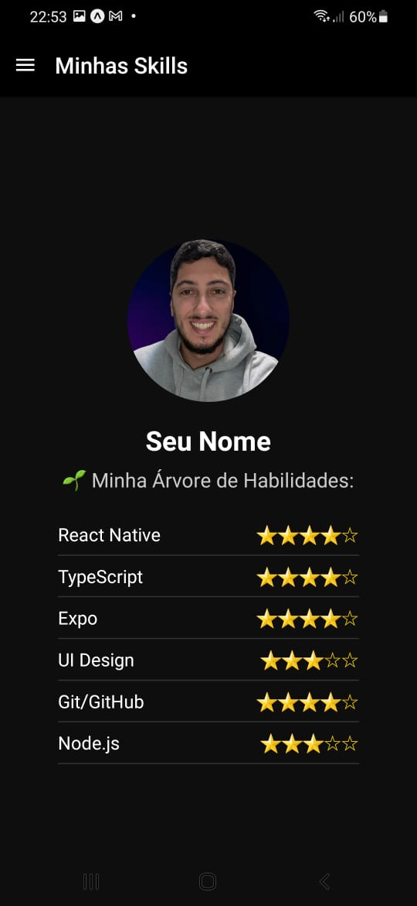

Segue **`README.md` atualizado** com a **seção de dependências obrigatórias** de forma clara e elegante para seu repositório:

---

````markdown
# React Native Drawer Profile App

Aplicação criada para praticar **React Native**, **componentização**, **estilização**, **React Navigation (Drawer)** e organização de código.

Este projeto contém:
✅ Uma tela de **perfil** (MainScreen) com foto, nome e links de contato.  
✅ Uma tela de **skills** (SkillScreen) com sua árvore de habilidades e níveis.  
✅ Navegação **Drawer** adaptada ao tema escuro.  
✅ Organização modular de componentes e estilos para facilitar reuso.

---

## 📱 Screenshots

### Tela Principal


### Tela de Skills


---

## 🚀 Tecnologias utilizadas

- [React Native](https://reactnative.dev/)
- [Expo](https://expo.dev/)
- [TypeScript](https://www.typescriptlang.org/)
- [React Navigation (Drawer)](https://reactnavigation.org/docs/drawer-based-navigation/)
- Estilização com `StyleSheet` do React Native

---

## ⚙️ Funcionalidades

✅ Tela de **perfil** com links clicáveis.  
✅ Tela de **skills** com visualização de níveis de habilidades.  
✅ Drawer lateral para navegação entre telas.  
✅ Tema escuro consistente em todo o app.

---

## 📦 Dependências obrigatórias

Para o **React Navigation Drawer** funcionar corretamente, instale os seguintes pacotes:

```bash
npx expo install react-native-screens react-native-safe-area-context
npm install @react-navigation/drawer
npx expo install react-native-gesture-handler react-native-reanimated
````

---

## 📂 Estrutura de Pastas

```
src/
  assets/                 # imagens e ícones
  components/             # componentes reutilizáveis
  routes/                 # DrawerRoutes e configuração de navegação
  screens/
    MainScreen/           # tela de perfil
    SkillScreen/          # tela de habilidades
App.tsx                   # ponto de entrada
```

---

## ▶️ Como executar

1️⃣ Clone o repositório:

```bash
git clone https://github.com/codeguima/my-profile-app.git
```

2️⃣ Instale as dependências:

```bash
npm install
# ou
yarn
```

3️⃣ Rode o projeto:

```bash
npx expo start
```

Abra no emulador ou leia o QR Code com o **Expo Go** no celular.

---

## 🧑‍💻 Aprendizados neste projeto

✅ Criação de telas utilizando `View`, `Text`, `Image`, `Pressable`, `FlatList`.
✅ Organização de estados locais e props entre componentes.
✅ Criação e estilização de botões e inputs reutilizáveis.
✅ Navegação Drawer com React Navigation (título, tema escuro).
✅ Estruturação modular com `TypeScript`.
✅ Uso de `Linking` para abrir links externos.

---

## ✨ Próximos passos

✅ Adicionar animações suaves com `react-native-reanimated`.
✅ Trocar tema claro/escuro dinamicamente com Context API.
✅ Armazenar dados dinâmicos com Context ou Zustand.
✅ Publicar no Expo para mostrar em seu portfólio.

---

## 🪐 Contato

* [Seu LinkedIn](https://www.linkedin.com/in/jhonny-guimaraes)
* [Seu GitHub](https://github.com/codeguima)
* Email: [seuemail@email.com](mailto:jhonnycodedev@gmail.com)

---

**🚀 Continue praticando e documentando seus projetos para fortalecer seu portfólio!**
